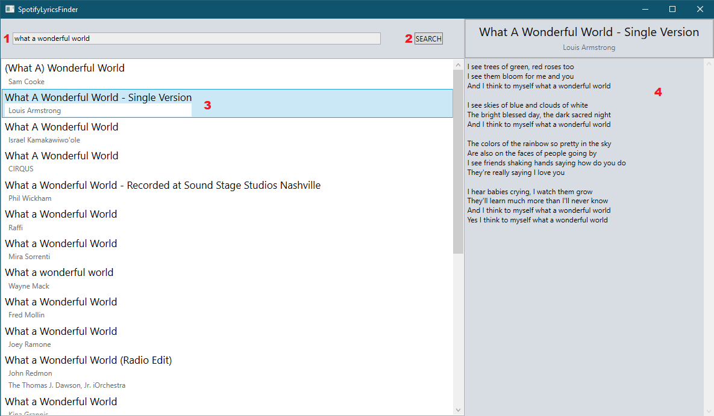

# SpotifyLyricsFinder
 An WPF application that searches songs on spotify, and then tries to find lyrics to a chosen one.
 I created it to learn, how to connect and use web APIs.

# Setup
If you want to compile and use the application, there are 2 things you must do:
* Get *Client ID* and *Client Secret* from your Spotify developer dashboard (you have to create a Spotify account if you don't have it), and put it into *_clientID* and *_clientSecret* in **APIs/SpotifyAuth.cs** file
* Get *API key* from your Apiseeds dashboard (you also have to create account here), and put it into *authorizaztionToken* in **APIs/ApiseedsAuth.cs** file

# Technologies
Project is created using Visual Studio 2017 with:
* .NET Framework 4.6.1
* Newtonsoft.JSON v12.0.3 package

# Usage
To use the application:
* Write a song title or artist in the search box **(1)**
* Press the **SEARCH** button **(2)**
* If songs were found, select one from the list **(3)**
* If the lyrics were found, they will appear on the side panel **(4)**

